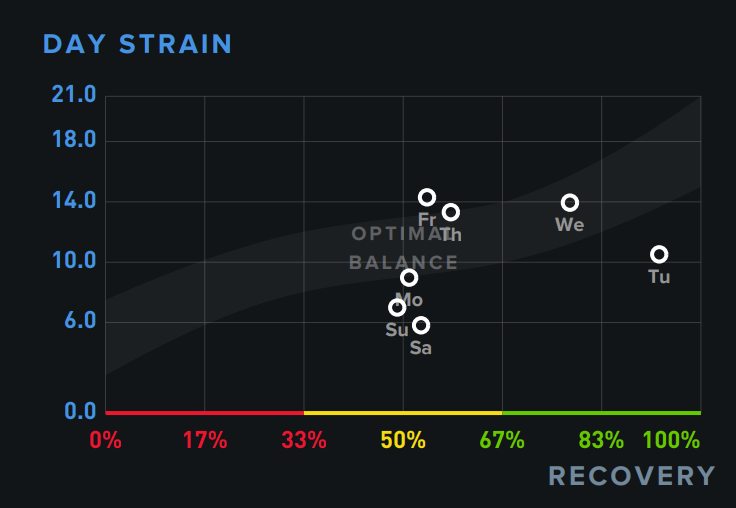
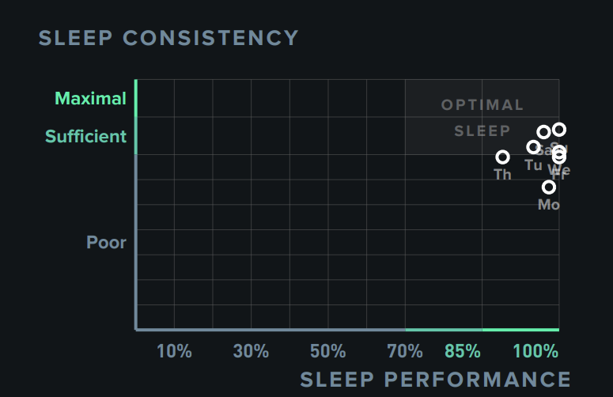
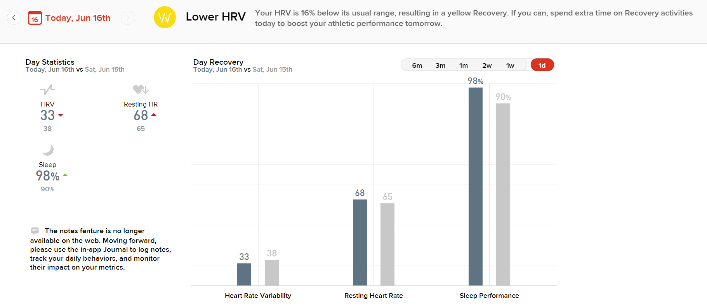
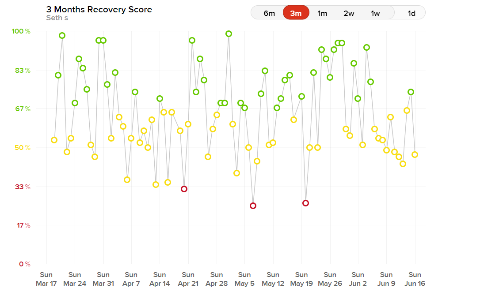
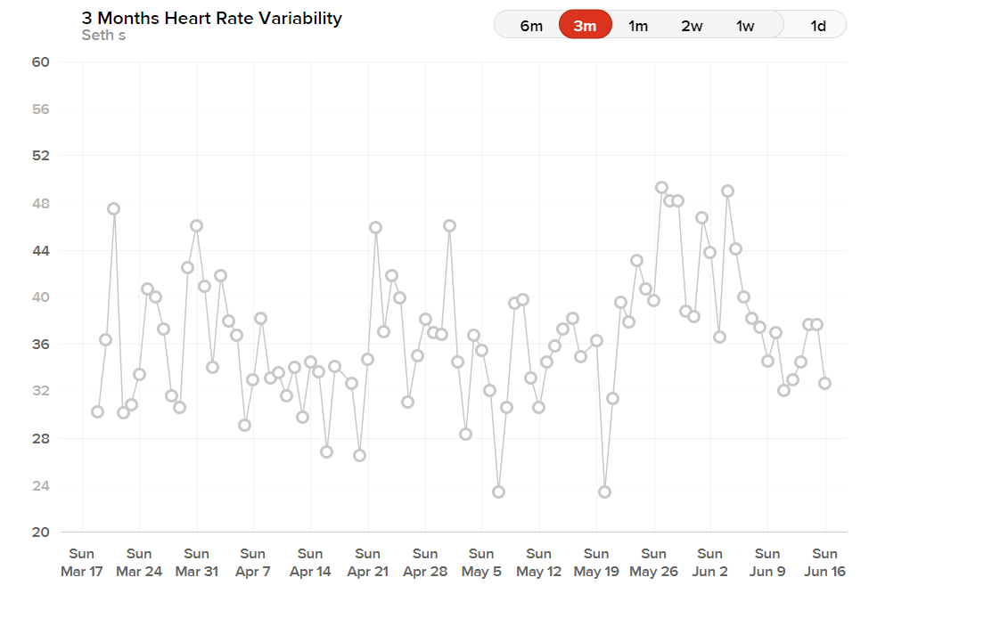
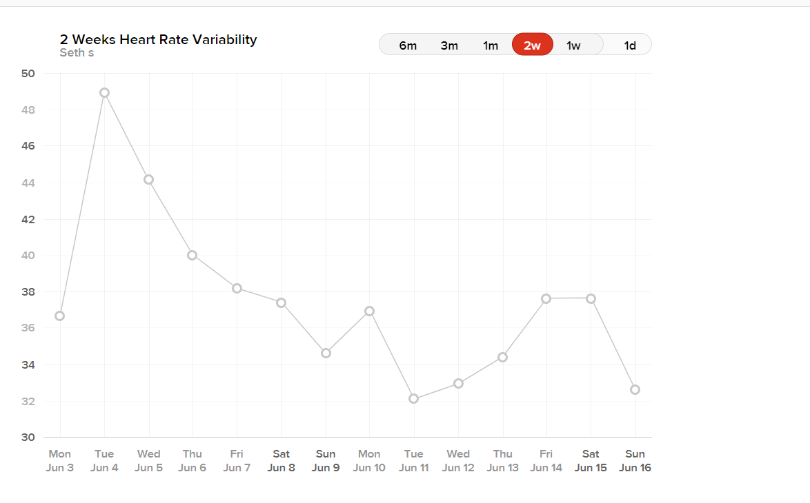

I need to fix myself.

My recovery this week.

Recovery this week has NOT been that great. With the highest recovery being on a Tuesday.. All my recoveries used to be near the 100% range.

My sleep has been somewhat consistent.. Even if it hasn't been great it's at least consistent.

I don't know... I have no words anymore. Let's see the trends.

I don't know. I honestly don't know.

If we look at a 2 weeks graph, we can see that my HRV is steadily decreasing. So whatever changed in this area is the cause.

Higher is better. The highest point on the graph being 49 which is my highest HRV ever, and the lowest on this is 32 which is low.

From what i've seen, peoples HRV are around 150!! Like the fuck??

Am I dying?

I don't know. I need to figure this out.