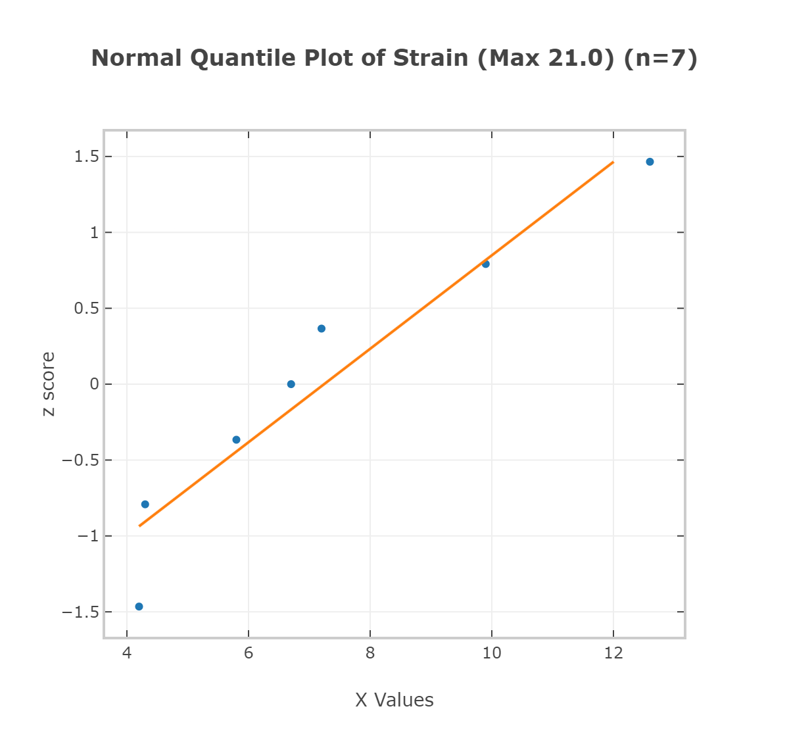

# Weekly analysis 1.

I will be analyzing my habits, health and sharing various metrics.

To start off, let's analyze my daily strain. This will help us identify potential anomalies and give us a better understanding of other metrics.


On the graph, we can see the day strain vs recovery.

What is interesting, `Wednesday` and `Saturday`, which have *~50%*, with `Wednesday` being a few percentages lower on the recovery scale - have..


Let's analyze the `strain` first.

## Strain

*Strain measures the cardiovascular and muscular load on the body throughout the day*

**Strain Values**

Light (0-9) - Minimal stress put on the body, room for active recovery

Moderate (10-13) - Moderate stres on the body, generally good for maintaining fitness

High (14-17) - Increased stress and activity level, ideal for making fitness gains when training

All out (18-21) - Significant stress, often overreaching, likely very difficult to recover from the next day


### Calculating Strain

Strain is calculated on a logarithmic scale, measured from:

- Heart Rate
- Duration & Intensity


First, let's import the data into a table, creating rows `1-7` referencing the days of the week, staring with `sunday`.

| Strain (max 21) |
| ------------- |
| |
| 4.3 |
| 4.2 |
| 9.9 |
| 7.2 |
| 5.8 |
| 12.6 |
| 6.7 |

Creating an initial histogram of *n=7*


This doesn't really give us the full picture, and is quite difficult to understand. We are just clustering here.

Instead, we can see the range within a boxplot:


We can see some valuable information such as:

`Min: 4.2`
`Q1: 4.3`
`Median: 6.7`
`Q3: 9.9`
`Max 12.6`

This lets us get a visual of the range. Theoretically the maximum amount of strain is 21.

Again, we can visualize this data:




Now, we can add some other values into the mix. Recovery is on a scale of 100%.

Following the recovery scores, on the same rows of `1-7`,

|Recovery Max (100%)|
|:----|
|6|
|87|
|97|
|44|
|64|
|79|
|51|

```mermaid!
xychart-beta
title "Recovery %"
    x-axis [1, 2, 3, 4, 5, 6, 7]
    y-axis [10, 20, 30, 40, 50, 60, 70, 80, 90, 100]
    bar [6, 87, 97, 44, 64, 79, 51]
```